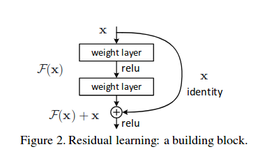
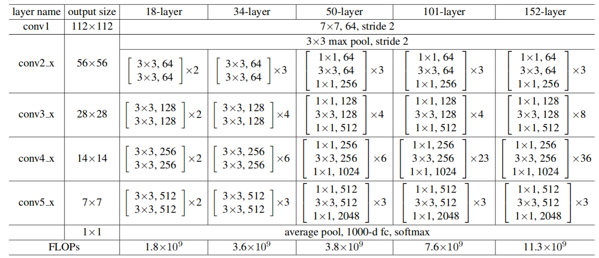

# ResNet34-TF2
This is an implementation of ResNet-34 in TensorFlow2.0 using the Imperative API (subclassing tensorflow.keras.Model)

### Residual blocks

### Code Walkthrough
The architecture is based on 34 layer sample (snippet from paper)

There are two key aspects to note here

 1. conv2_1 has stride of (1, 1) while remaining conv layers has stride (2, 2) at the beginning of the block.
 2. At the end of the first skip connection of a block, there is a disconnect in number of filters, width and height at the merge layer. This is addressed by shortcut conv3 in ResBlock
For remaining cases, input is directly merged with residual block as identity. Note that each Conv2D layer is followed by batch normalization.

## References
ResNet 34 as described in [Deep Residual Learning for Image Recognition](https://arxiv.org/pdf/1512.03385.pdf)
